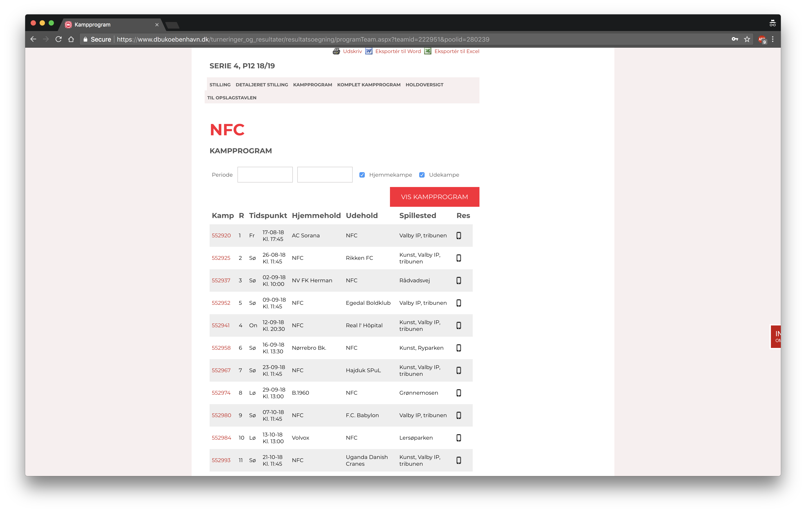
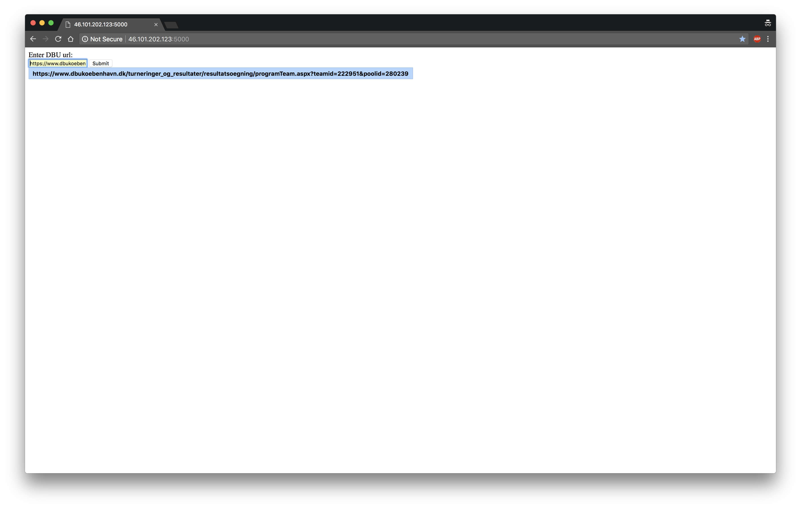
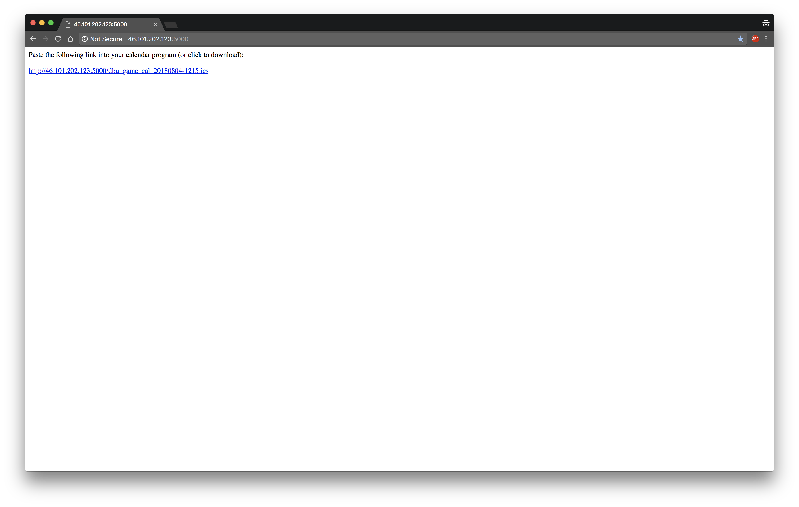
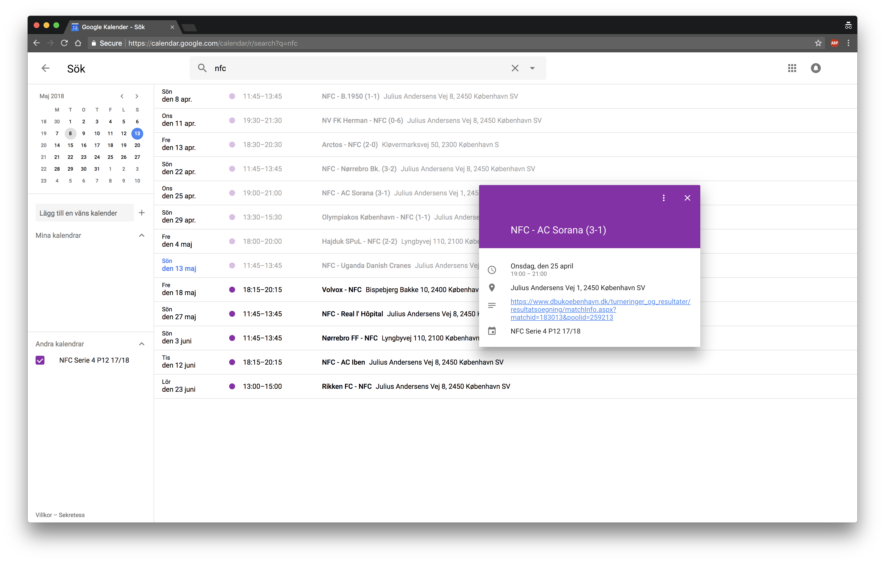

# dbu2cal
Scrape DBU schedules and convert to iCal.

## How to use
1. Fire up the two docker containers - one for the web app and one containing a cron job to keep the calendars updated.

2. Find your team's fixture list on dbu.dk. Copy the url.

3. Enter the url in your self-hosted web app (or at http://46.101.202.123:5000/ if the site is up).

4. Copy the returned url pointing to the hosted calendar.

5. Subscribe to the calendar in e.g. Google Calendar (https://support.google.com/calendar/answer/37100?hl=en&co=GENIE.Platform%3DDesktop).

6. Get result updates and other details directly to your calendar.

